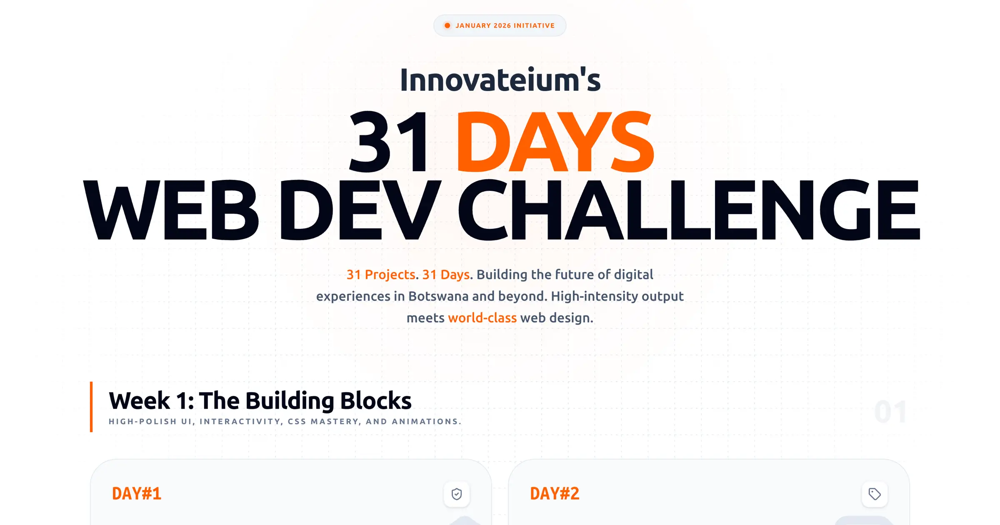

# 31 Days of Web Development Challenge Landing Page

Welcome to the official landing page for the **31 Days of Web Development Challenge**, an initiative by **Innovateium** designed to push the boundaries of modern web interfaces, interactivity, and design.



## 🚀 Overview

This repository contains the source code for the landing page that showcases 31 unique web development projects. Each day of the challenge focuses on a specific theme, ranging from high-polish UI components to complex web applications and next-gen technologies like 3D rendering and AI integration.

The landing page itself is a testimonial to modern web standards, featuring:

- **Interactive Bento Grid**: A dynamic layout showcasing all 31 challenges.
- **Project Modals**: Detailed views for each challenge, including concepts, technologies used, and live links.
- **Premium Aesthetics**: A sleek dark/light mode interface with glassmorphism, smooth animations, and a focus on visual excellence.
- **Responsive Design**: Fully optimized for a seamless experience across all device sizes.

## 🛠️ Tech Stack

Built with a modern and high-performance stack:

- **Framework**: [Next.js 16 (App Router)](https://nextjs.org/)
- **Language**: [TypeScript](https://www.typescriptlang.org/)
- **Styling**: [Tailwind CSS 4](https://tailwindcss.com/)
- **Animations**: [Motion (Framer Motion)](https://motion.dev/)
- **Icons**: [Lucide React](https://lucide.dev/)
- **Theming**: [next-themes](https://github.com/pacocoursey/next-themes)
- **Deployment**: [Vercel](https://vercel.com/)

## 📅 The Journey

The challenge is structured into five key phases:

1.  **Week 1: The Building Blocks**: High-polish UI, interactivity, and CSS mastery.
2.  **Week 2: Small Business Essentials**: Conversion optimization and rapid layout deployment.
3.  **Week 3: Complexity & Architecture**: Multi-page structures and data organization.
4.  **Week 4: Web Applications**: JavaScript logic and API integration.
5.  **Wildcard Days: The Future**: 3D rendering, AI, and cutting-edge web tech.

## 🏁 Getting Started

### Prerequisites

- Node.js 18+
- npm / yarn / pnpm

### Installation

1.  Clone the repository:
    ```bash
    git clone https://github.com/innovateium/31dayslanding.git
    ```
2.  Install dependencies:
    ```bash
    npm install
    ```
3.  Run the development server:
    ```bash
    npm run dev
    ```

Open [http://localhost:3000](http://localhost:3000) with your browser to see the result.

## 🤝 About Innovateium

Innovateium is a digital solutions provider focused on creating impactful software and helping developers grow through challenges and community-driven projects.

- **Website**: [innovateium.co.bw](https://innovateium.co.bw)
- **GitHub**: [@innovateium](https://github.com/innovateium)
- **Instagram**: [@innovateium](https://www.instagram.com/innovateium)

---

Built with ❤️ by [Innovateium](https://innovateium.co.bw) in Botswana 🇧🇼
